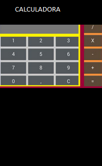
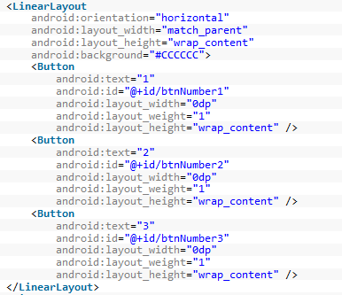
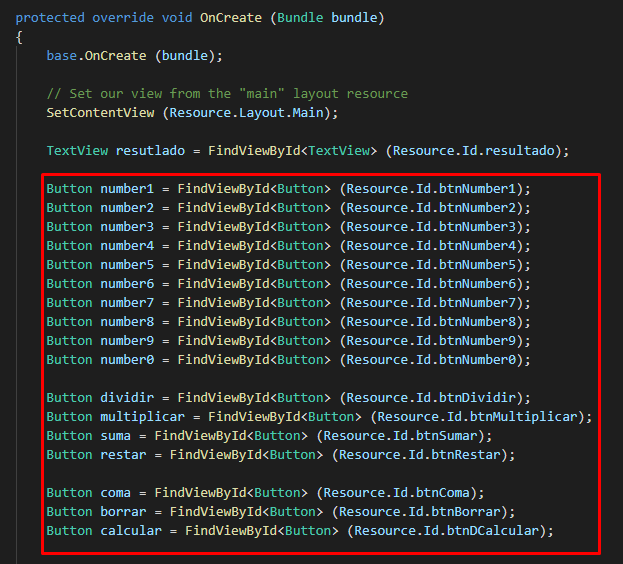
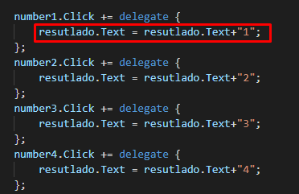
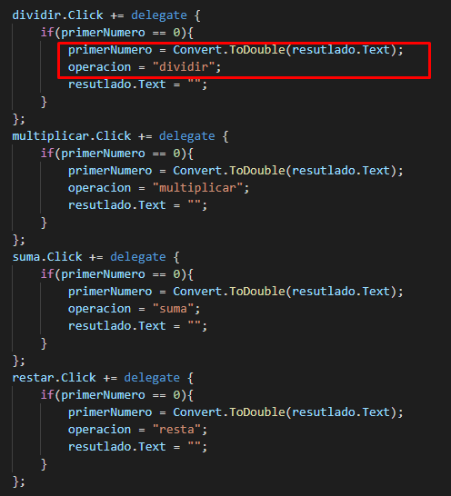
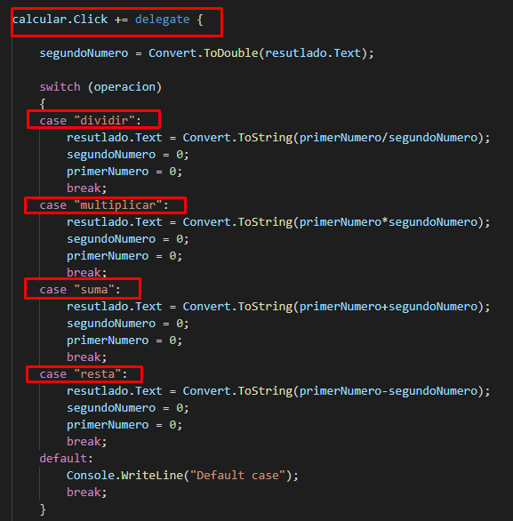
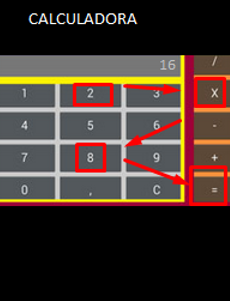

# xamarin_ejercicio

 Calculadora xamarin-android
 

front_end calculadora

botones

agregar texto botones

accion de los botones sumas-restar-multiplicar-dividir

Switch para realizar el proceso de suma_resta_multiplicar_dividir

Resultado

